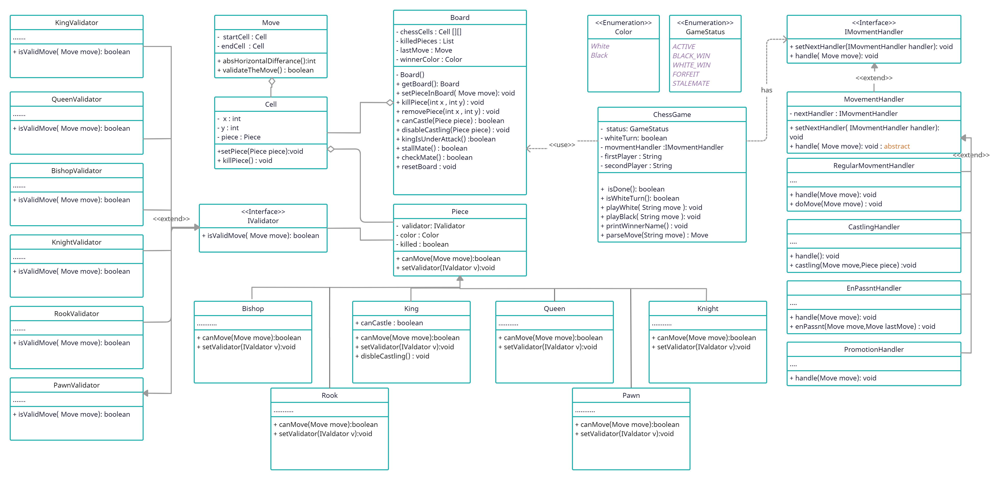
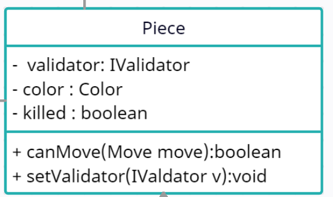
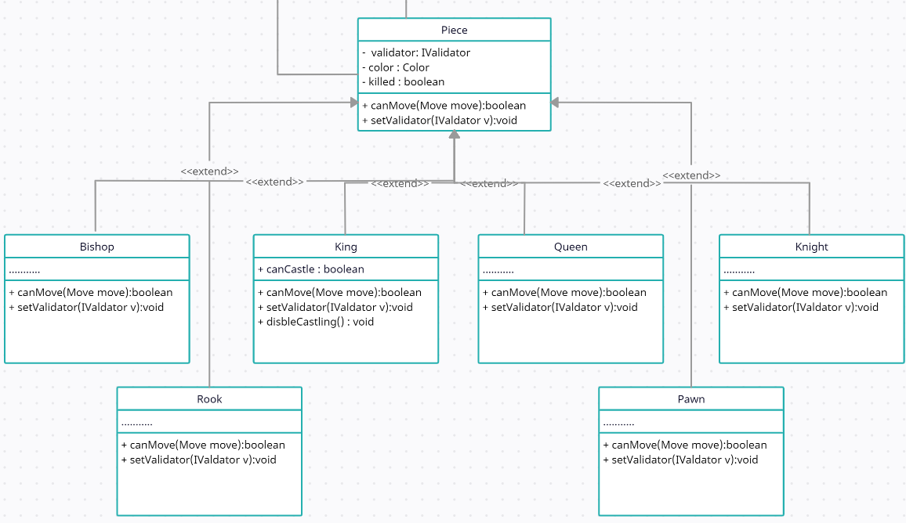
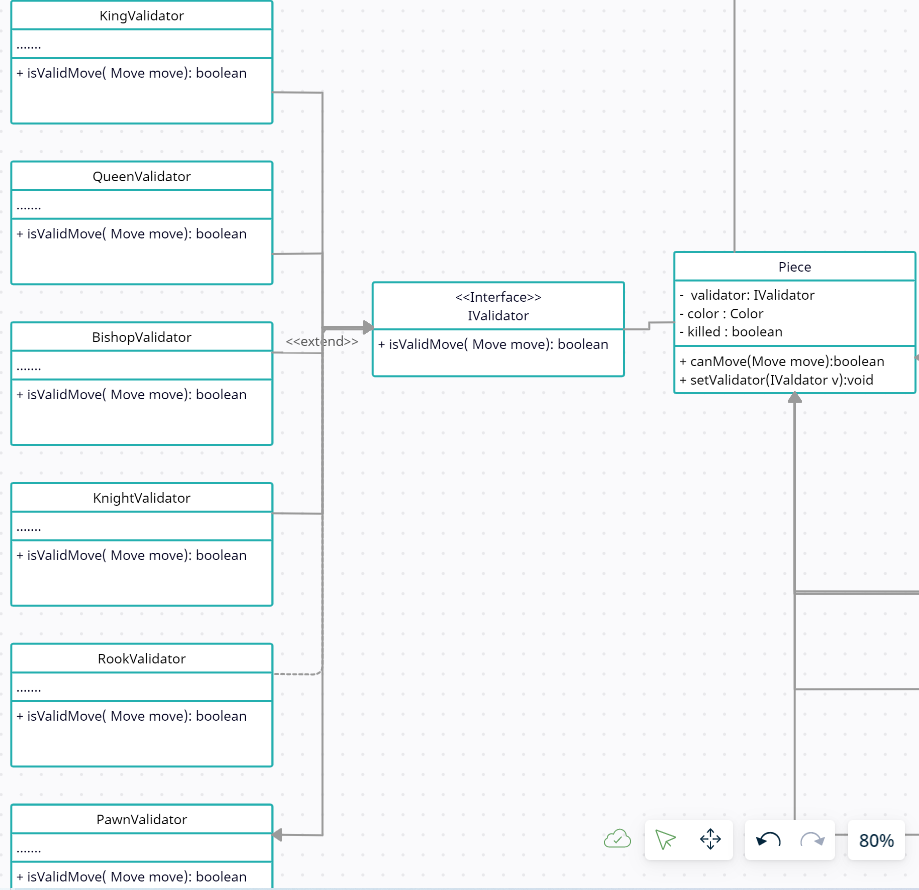

# Chess Game Design

### Talking about my design and implementation, My design follows the OOP principles, clean referring to clean code principles of Uncle Bob, “Effective Java” items, and the most important one it has to follow the SOLID  principles.

## My Approach

## The Pieces

The first and the most important component of the game is the pieces, where I tend to represent the pieces with a super
type class called Piece, and as I mentioned before where each piece has its own rules of moving but at the same time the
pieces have similar things in common, so for the approach of isolating the business logic and extracting the behavior of
moving rules I used the Strategy Pattern.

### Pieces Strategy

First, the design ensures that the system has a high Abstraction by breaking the design down into simplified classes
with easy and straightforward usage.

Also having a high Encapsulation where the logic and details are hidden from the client and given low profile methods to
use, leads to minimizing the accessibility and accessorizing it like what effective java recommended.

And using Inheritance and Polymorphism to create and consume various types of pieces

Each piece has its own validation mechanism to handle the validation, using the Strategy Pattern, giving the ability to
use several strategies in each type of piece.

Making my design applied to the SOLID Principles where it’s very open for extension and closed for modification and
following Liskov’s to ensure the inheritance is not misused and so on with other principles.

## The Board

The board where the pieces in the game going to set and move, it’s contained 8x8 cells, making 64 places for the piece
to play.

To separate the concerns and make a cleaner code, I made the cell class that holds the piece on the board and give a
cleaner and simpler representation.

Where its single responsibility is holding the piece by creating a holder to access the piece and know his position on
the board.

Now the vision of the board getting clearer where it contains 64 cells, But in order to make sure that I can’t have more
than one board for every game, I tend to design to be a Singleton Class.

### Singleton Board

Each game should only have one board shared throw all the system, I designed a singleton class to strict the access and
give it like a global variable.

Giving it highly abstracted and encapsulated properties, with separated methods to manipulate the pieces in cells and
minimizing the accessibility, as Joshua Bloch recommended in his book.

Okay, we have the pieces and the board to play, we know the rules to play? Right? …as I mentioned, there are also more
special rules applied to the game alongside the rules for each piece.

## The Special Movement

Alongside the regular movement of pieces, there are three special movements Castling, Promotion, and En passant.

These special moves accrue individually, and they can’t accrue together at the same time, okay… our scenario is: the
player enters the movement request, and I have to figure out the type of movement request and handle it… let’s think
about a pattern that is going to help me process this problem.

### Chain Of Movement

For the sake of making my system as modular as possible and be extended by new rules in the future, I have used the
chain of responsibility pattern to give the power of handling different types of movement and movement rules, and the
ability to add more and more of these handlers in the future.

### Movement Handler

### Castling Handler

The first handler, is responsible for handling the castling movement, castling the king long or low depending on the
move of the player.

### Promotion Handler

When the Pawn reaches the end of the board the player has the ability to promote his pawn to a higher piece (Queen,
Knight, Rook, Bishop), and for simplicity I make to promote automatically to Queen.

### En Passant Handler

When a pawn does a double cell move, if there is an opponent pawn in range he can kill him as he just has done a single
cell move, not double.

### Regular Handler

So if the request passed all the previous handlers, then we are sure it’s a regular move request.

Using a chain of responsibility made the Movement handling in my code fully pass coverage of following the SOLID
principles, so by default made my code cleaner and have higher cohesion and loosely coupled.

And in the future, you can add new rules easily and with less effort.

## Move

It’s a data class made to carry movement data throw out of the system to remove the code smell of the data clumps and
long parameters methods, And as a fix and good design of a data class smell, I gave it some useful methods to have a
better and cleaner design.

## Enums Used

### Game Status

To holds the info about the state of the game

### Color

## Chess Game

A simplified interface to the game to give abstracted, encapsulated, and straightforward usage. This leads to lower the
coupling between the system and the client if he wants to build and extend over it. So close to being a Façade Class.

Overall it’s a simple interface abstracted and has the responsibility to control the flow of the game, giving solid and
high cohesion methods and class in general.

## Conclusion

The design have follows the OOP pillars in every part, with highly abstracted and encapsulated classes and methods, and
taking huge advantage of the generalization and polymorphism while dealing with the different types of pieces and their
different Validators of movement.

And of course, using good patterns to follow to make the code modular and easy to be extended in the future.

Of course, the clean code was an important aspect to follow where I cleaned the code following uncle Bob's instructions
by making my code DRY, solving the data clumps and long parameters smells with solutions like the Cell and the Move
classes, and making sure to make every class and method highly cohesive and loosely coupled.

The effective java items like before principles have a huge difference in my design decisions, like the item of
Minimizing the accessibility of classes and members and using accessor methods, and of course, minimizing the mutability
of most of the classes as possible.

Also using his items as possible on creating and managing the Singleton class (Board), and using enums to represent some
states of the game

Overall, I tried to coup up with what I learned from fast reading the book and, as the writer suggests, having optimized
judiciously rather than a fast solution.

SOLID was the most important principle to follow, making every class have one responsibility and concern, of course by
using good patterns and simple solutions in general leads to having an open system for an extension by the ability to
add new chess pieces and new movement behaviors and of course new game rules very easily, and following Liskov’s
principle to avoid misusing the inheritance, and obviously segregating the interfaces, and making the solution dependent
on interfaces and high-level class on the piece usage to make right follow of the Dependency Inversion Principle.

## The Game Play

When you run the game, give two players names; the first will have the white side and the other the black one.

As in any game of chess, the game started with the white player entering his move with the specific format “move B2 B3”
then if giving a valid move the turn goes to the other player and so on till the game is done when a player checkmates
the other player.

An illegal move happens when a player entered an invalid input format or a move that does not go well with the game
rules, so the player will be informed and asked to play again.

Let’s say the two players keep playing right, the one who checkmates the other will win, and the game prints his name on
the console

Helping functionality, I have implemented a print method in the chess game class to help visualize the game state, by
printing to console the board and the pieces on it along with the killed pieces.

### Sample play

My friend Haitham and I played a simple game to represent a tested and sample use of my game, and he wins of course
because I’m new to the game :(.

#### [sample game](resources/chessInput.txt)

Hope you enjoy the game

Have an amazing day
